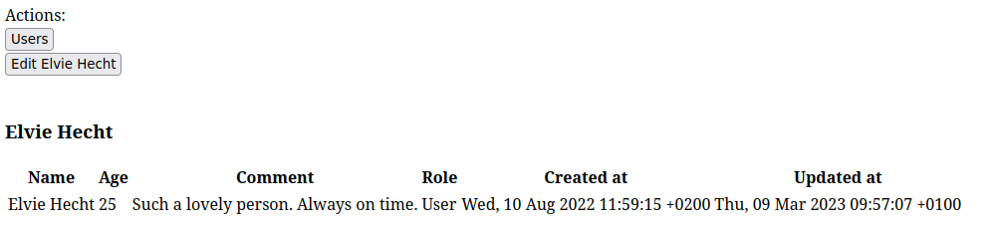
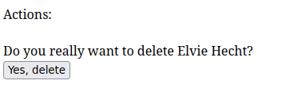
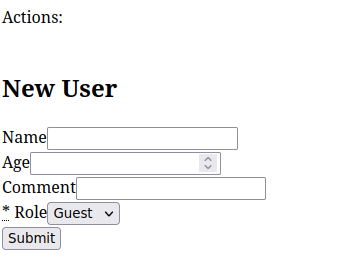
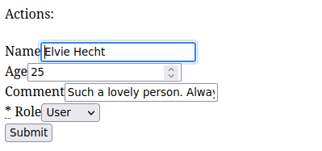
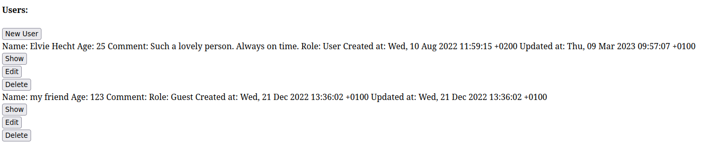

TODO: Write this

Notes:

- `model` is an ApplicationModel or similar (e.g. ActiveType, but not guarantted to work at this point), `.model_name` is important
- `data` can be model or models
- To redirect instead of rendering, use `before_render` if the redirect is conditional (e.g. if validation passes), or `respond` if always redirecting.
  - As a rule of thumb, use `before_render` if there is a `content` block (even by inheritance) and `respond` otherwise.
- To protect a custom controller by Compony authentication, use in the controller: `before_action Compony.authentication_before_action`

Feature sets:

- Base feature: Components
  - replace routes, views and controllers
  - actions
  - params and nesting
  - skipping authentication
  - lifecycle
    - standalone
    - resourcefulness
    - authorization
- Buttons and links
  - labelling
  - coloring
- Fields and field groups
- Feasibility
- Premade components
  - button
  - destroy
  - form
  - with_form
  - new
  - edit

# Introduction

Compony is a Gem that allows you to write your Rails application in component-style fashion. It combines a controller action and route along with its view into a single Ruby class. This allows writing much DRYer code, using inheritance even in views and much easier refactoring for your Rails applications, helping you to keep the code clean as the application evolves.

Compony's key aspects:

- A Compony component is a single class that exports route(s), controller action(s) and a view to Rails.
  - Refactor common logic into your own components and inherit from them to DRY up your code.
- Compony's powerful model mixin allows you to define metadata in your models and react to them. Examples:
  - Compony fields capture attributes that should be made visible in your UI. They allow you to implement formatting behavior and parameter sanitization for various types, e.g. URLs, phone numbers, colors etc. ready to be used in your lists, detail panels, or forms.
  - Compony's feasibility framework allows you to prohibit actions based on conditions, along with an error message. This causes all buttons pointing to that action to be disabled with a meaningful error message.
- Compony only structures your code, but provides no style whatsoever. It is like a bookshelf rather than a reader's library. You still implement your own layouts, CSS and Javascript to define the behavior of your front-end.
- Using Compony, you **can** write your application as components, but it is still possible to have regular routes, controllers and views side-to-side to it. This way, you can migrate your applications to Compony little by little and enter and leave the Compony world as you please. It is also possible to render Compony components from regular views and vice versa.
- Compony is built for Rails 7 and fully supports Stimulus and Turbo Drive. Turbo Frames and Streams are not yet targetted, so Compony is currently meant for websites where every click triggers a "full page load" (in quotes because they are not actually full page loads due to Turbo Drive).
- Compony uses CanCanCan (https://github.com/CanCanCommunity/cancancan) for authorization but does not provide an authentication mechanism. You can easily build your own by creating login/logout components that manage cookies, and configure Compony to enforce authentication using the `Compony.authentication_before_action` setter.

## State of the project

I am actively using this framework in various applications and both performance and reliability are good. However, the project is at an early stage and is lacking peer reviews and especially automatic testing, such as unit and integration tests. Also, expect there to be (documented) breaking changes in the future, as the API will likely be further refined, resulting in renamings and deprecation of various methods.

## Example

To get you a rough idea what working with Compony feels like, let's look at a small dummy application using Compony from scratch, to make this example as explicit as possible. In practice, much of the logic shown here would be moved to abstract components that you can inherit from.

The example is meant to be read top-down and information will mostly not be repeated. Comments will give you a rough idea of what's going on on each line. The features are more completely documented in subsequent chapters.

Let's implement a simple user management page with Compony. User's have a name, an integer age, a comment, as well as a role (which we will conveniently model using `AnchorModel`: https://github.com/kalsan/anchormodel). We want to be able to list, show, create, edit and destroy users. Users having the role Admin shall not be destroyed.

### The User model

We'll assume a model that has the standard Rails schema:

```ruby
create_table 'users', force: :cascade do |t|
    t.string 'name'
    t.string 'comment'
    t.integer 'age'
    t.datetime 'created_at', null: false
    t.datetime 'updated_at', null: false
    t.string 'role', default: 'guest', null: false
  end
```

```ruby
class User < ApplicationRecord
  # Refer to https://github.com/kalsan/anchormodel
  belongs_to_anchormodel :role

  # Fields define which attributes are relevant in the GUI and how they should be presented.
  field :name, :string
  field :age, :integer
  field :comment, :string
  field :role, :anchormodel
  field :created_at, :datetime
  field :updated_at, :datetime

  # The method `label` must be implemented on all Compony models. Instead of this method, we could also rename the column :name to :label.
  def label
    name
  end

  # This is how we tell Compony that admins are not to be destroyed.
  prevent :destroy, 'Cannot destroy admins' do
    role == Role.find(:admin)
  end
end
```

### The Show component

This components loads a user by reading the param `id`. It then displays a simple table showing all the fields defined above.

We will implement this component on our own, giving you an insight into many of Compony's mechanisms:

```ruby
# All components (except abstract ones) must be placed in the `Components` namespace living under `app/components`.
# They must be nested in another namespace, called "family" (here, `Users`), followed by the component's name (here, `Show`).
class Components::Users::Show < Compony::Component
  # The Resourceful mixin causes a component to automatically load a model from the `id` parameter and store it under `@data`.
  # The model's class is inferred from the component's name: `Users::Show` -> `User`
  include Compony::ComponentMixins::Resourceful

  # Components are configured in the `setup` method, which prevents loading order isues.
  setup do
    # The DSL call `label` defines what what is the title of the component and which text is displayed on links and buttons pointing to it.
    # It accepts different formats and takes a block. Given that this component always loads one model, the block must take an argument which is the model.
    # The argument must be provided by links and buttons pointing to this component.
    label(:short) { |_u| 'Show' } # The short format is suitable for e.g. a button in a list of users.
    label(:long) { |u| "Show user #{u.label}" } # The long format is suitable e.g. in a link in a text about this user.

    # Actions point to other components. They have a name that is used to identify them (e.g. in the `prevent` call above) and a block returning a button.
    # Compony buttons take the name to an action and either a family name or instance, e.g. a Rails model instance.
    # Whether or not an instance must be passed is defined by the component the button is pointing to (see the comment for `label` earlier in the example).
    action(:index) { Compony.button(:index, :users) } # This points to `Components::Users::Index` without passing a model (because it's an index).
    action(:edit) { Compony.button(:edit, @data) } # This points to `Components::Users::Edit` for the currently loaded model. This also checks feasibility.

    # When a standalone config is present, Compony creates one or multiple Rails routes. Components without standalone config must be nested within others.
    standalone path: 'users/show/:id' do # This specifies the path to this component.
      verb :get do # This speficies that a GET route should be created for the path specified above.
        authorize { true } # Immediately after loading the model, this is called to check for authorization. `true` means that anybody can get access.
      end
    end

    # After loading the model and passing authorization, the `content` block is evaluated. This is Compony's equivalent to Rails' views.
    # Inside the `content` block, the templating Gem Dyny (https://github.com/kalsan/dyny) is used, allowing you to write views in plain Ruby.
    content do
      h3 @data.label # Display a <h3> title
      table do # Open a <table> tag
        tr do # Open a <tr> tag
          # Iterate over all the fields defined in the model above and display its translated label (this uses Rails' `human_attribute_name`), e.g. "Name".
          @data.fields.each_value { |field| th field.label }
        end # Closing </tr>
        tr do
          # Iterate over the fields again and call `value_for` which formats each field's value according to the field type.
          @data.fields.each_value { |field| td field.value_for(@data) }
        end
      end
    end
  end
end
```

Here is what our Show component looks like when we a layout with the bare minimum and no styling at all:



It is important to note that actions, buttons, navigation, notifications etc. are handled by the application layout. In this and the subsequent screenshots, we explicitely use minimalism, as it makes the generated HTML clearer.

### The Destroy component

Compony has a built-in abstract `Destroy` component which displays a confirmation message and destroys the record if the verb is `DELETE`. This is a good example for how DRY code can become for "boring" components. Since everything is provided with an overridable default, components without special logic can actually be left blank:

```ruby
class Components::Users::Destroy < Compony::Components::Destroy
end
```

Note that this component is fully functional. All is handled by the class it inherits from:



### The New component and the Form component

Compony also has a pre-built abstract `New` component that handles routing and resource manipulation. It combines the controller actions `new` and `create`, depending on the HTTP verb of the request. Since it's pre-built, any "boring" code can be omitted and our `New` components looks like this:

```ruby
class Components::Users::New < Compony::Components::New
end
```

By default, this component looks for another component called `Form` in the same directory, which can look like this:

```ruby
class Components::Users::Form < Compony::Components::Form
  setup do
    # This mandatory DSL call prepares and opens a form in which you can write your HTML in Dyny.
    # The form is realized using the simple_form Gem (https://github.com/heartcombo/simple_form).
    # Inside this block, more DSL calls are available, such as `field`, which automatically generates
    #    a suitable simple_form input from the field specified in the model.
    form_fields do
      concat field(:name) # `field` checks the model to find out that a string input is needed here. `concat` is the Dyny equivalent to ERB's <%= %>.
      concat field(:age)
      concat field(:comment)
      concat field(:role) # Compony has built-in support for Anchormodel and as the model declares `role` to be of type `anchormodel`, a select is rendered.
    end

    # This DSL call is mandatory as well and automatically generates strong param validation for this form.
    # The generatd underlying implementation is Schemacop V3 (https://github.com/sitrox/schemacop/blob/master/README_V3.md).
    schema_fields :name, :age, :comment, :role
  end
end
```

This is enough to render a fully functional form that creates new users:



### The Edit component

Just like `New`, `Edit` is a pre-built component that handles routing and resource manipulation for editing models, combinding the controller actions `edit` and `update` depending on the HTTP verb. It uses that same `Form` component we wrote above and thus the code is as simple as:

```ruby
class Components::Users::Edit < Compony::Components::Edit
end
```

It then looks like this:



### The Index component

This component should list all users and provide buttons to manage them. We'll build it from scratch and make it resourceful, where `@data` holds the ActiveRecord relation.

```ruby
class Components::Users::Index < Compony::Component
  # Making the component resourceful enables a few features for dealing with @data.
  include Compony::ComponentMixins::Resourceful

  setup do
    label(:all) { 'Users' } # This sets all labels (long and short) to 'Users'. When pointing to this component using buttons, we will not provide a model.
    standalone path: 'users' do # The path is simply /users, without a param. This conflicts with `Resourceful`, which we will fix in `load_data`.
      verb :get do
        authorize { true }
      end
    end

    # This DSL call is specific to resourceful components and overrides how a model is loaded.
    # The block is called before authorization and must assign a model or collection to `@data`.
    load_data { @data = User.all }

    content do
      h4 'Users:' # Provide a title
      # Provide a button that creates a new user. Note that we must write `:users` (plural) because the component's family is `Users`.
      concat compony_button(:new, :users) # The `Users::New` component does not take a model, thus we just pass the symbol `:users`, not a model.

      div class: 'users' do # Opening tag <div class="users">
        @data.each do |user| # Iterate the collection
          div class: 'user' do # For each element, open another div
            User.fields.values.each do |field| # For each user, iterate all fields
              span do # Open a <span> tag
                concat "#{field.label}: #{field.value_for(user)} " # Display the field's label and apply it to value, as we did in the Show component.
              end
            end
            # For each user, add three buttons show, edit, destroy. The method `with_button_defaults` applies its arguments to every `compony_button` call.
            # The option `format: :short` causes the button to call the target component's `label(:short) {...}` label function.
            Compony.with_button_defaults(label_opts: { format: :short }) do
              concat compony_button(:show, user) # Now equivalent to: `compony_button(:show, user, label_opts: { format: :short })`
              concat compony_button(:edit, user)
              concat compony_button(:destroy, user)
            end
          end
        end
      end
    end
  end
end
```

The result looks like this:



Note how the admin's delete button is disabled due to the feasibility framework. Pointing the mouse at it causes a tooltip saying: "Cannot destroy admins.", as specified in the model's prevention.

# Installation

## Installing Compony

First, add Compony to your Gemfile:

```ruby
gem 'compony'
```

Then run `bundle install`.

Create the directory `app/components`.

In `app/models/application_record.rb`, add the following line below `primary_abstract_class`:

```ruby
include Compony::ModelMixin
```

## Installing cancancan

Create the file `app/models/abilty.rb` with the following content:

```ruby
class Ability
  include CanCan::Ability

  def initialize(_user)
    can :manage, :all
  end
end
```

This is an initial dummy ability that allows anyone to do anything. Most likely, you will want to adjust the file. For documentation, refer to [https://github.com/CanCanCommunity/cancancan/](https://github.com/CanCanCommunity/cancancan/).

## Optional: installing anchormodel

To take advantage of the anchormodel integration, follow the installation instructions under [https://github.com/kalsan/anchormodel/](https://github.com/kalsan/anchormodel/).

# Usage

Compony components are nestable elements that are capable of replacing Rails' routes, views and controllers. They structure code for data manipulation, authentication and rendering into a single class that can easily be subclassed. This is achieved with Compony's DSL that provides a readable and overridable way to store your logic.

Just like Rails, Compony is opinionated and you are advised to structure your code according to the examples and explanations. This makes it easier for others to dive into existing code.

## A basic (bare) component

### Naming

Compony components must be named according to the pattern `Components::FamilyName::ComponentName`.

- The family name should be pluralized and is analog to naming a Rails controller. For instance, when you would create a `UsersController` in plain Rails, the Compony family equivalent is `Users`.
- The component name is the Compony analog to a Rails action.

Example: If your plain Rails `UsersController` has an action `show`, the equivalent Compony component is `Components::Users::Show` and is located under `app/components/users/show.rb`.

If you have abstract components (i.e. components that your app never uses directly, but which you inherit from), you may name and place them arbitrarly.

### Initialization, manual instantiation and rendering

You will rarely have to override `def initialize` of a component, as most of your code will go into the component's `setup` block as explained below. However, when you do, make sure to forward all default arguments to the parent class, as they are essential to the component's function:

```ruby
def initialize(some_positional_argument, another=nil, *args, some_keyword_argument:, yetanother: 42, **kwargs, &block)
  super(*args, **kwargs, &block) # Typically you should call this first
  @foo = some_positional_argument
  @bar = another
  @baz = some_keyword_argument
  @stuff = yetanother
end
```

Typically, your components will be instantiated and rendered by Compony through the "standalone" feature explained below. Nonetheless, it is possible to do so manually as well, for instance if you'd like to render a component from within an existing view in your application:

```erb
<% index_users_comp = Components::Users::Index.new %>
<%= index_users_comp.render(controller) %>
```

Note that rendering a component always requires the controller as an argument. It also possible to pass an argument `locals` that will be made available to `render` (see below):

```erb
<% index_users_comp = Components::Users::Index.new %>
<%= index_users_comp.render(controller, locals: { weather: :sunny }) %>
```

### Setup

Every component must call the static method `setup` which will contain most of the code of your components. This can be achieved either by a call directly from your class, or by inheriting from a component that calls `setup`. If both classes call the method, the inherited class' `setup` is run first and the inheriting's second, thus, the child class can override setup properties of the parent class.

Call setup as follows:

```ruby
class Components::Users::Show < Compony::Component
  setup do
    # Your setup code goes here
  end
end
```

The code in setup is run at the end the component's initialization. In this block, you will call a number of methods that define the component's behavior and which we will explain now.

#### Labelling

This defines a component's label, both as seen from within the component and from the outside. You can query the label in order to display it as a title in your component. Links and buttons to components will also display the same label, allowing you to easily rename a component, including any parts of your UI that point to it.

Labels come in different formats, short and long, with long being the default. Define them as follows if your component is about a specific object, for instance a show component for a specific user:

```ruby
setup do
  label(:short) { |user| user.label } # Assuming your User model has a method or attribute `label`.
  label(:long) { |user| "Displaying user #{user.label}" } # In practice, you'd probably use I18n.t or FastGettext here to deal with translations.

  # Or use this short hand to set both long and short label to the user's label:
  label(:all) { |user| user.label }
end
```

To read the label, from within the component or from outside, proceed as follows:

```ruby
label(User.first) # This returns the long version: "Displaying user John Doe".
label(User.first, format: :short) # This returns the short version "John Doe".
```

It is important to note that since your label block takes an argument, you must provide the argument when reading the label (exception: if the component implements the method `data` returning an object, the argument can be omitted and the label block will be provided that object). Only up to one argument is supported.

Here is an example on how labelling looks like for a component that is not about a specific object, such as an index component for users:

```ruby
setup do
  label(:long) { 'List of users' }
  label(:short) { 'List' }
end
```

And to read those:

```ruby
label # "List of users"
label(format: :short) # "List"
```

If you do not define any labels, Compony will fallback to the default which is using Rail's `humanize` method to build a name from the family and component name, e.g. "index users".

Additionally, components can specify an icon and a color. These are not used by Compony directly and it is up to you to to define how and where to use them. Example:

```ruby
setup do
  color { '#AA0000' }
  icon { %i[fa-solid circle] }
end
```

To retrieve them from outside the component, use:

```ruby
my_component.color # '#AA0000'
my_component.icon # [:'fa-solid', :circle]
```

#### Providing content

Basic components do not come with default content. Instead, you must call the method `content` inside the setup block and provide a block containing your view. It will be evaluated inside a `RequestContext` (more on that later).

In this block, provide the HTML to be generated using Dyny: [https://github.com/kalsan/dyny](https://github.com/kalsan/dyny)

Here is an example of a component that renders a title along with a paragraph:

```ruby
setup do
  label(:all) { 'Welcome' }
  content do
    h1 'Welcome to my basic component'
    para "It's not much, but it's honest work."
  end
end
```

If a subclass component calls `content`, it overwrites the block of the parent class, replacing the entire content. To make overwriting more granular, you can use `add_content` instead of `content`. This method can be called multiple times to create an array of content. If no argument is specified, the new content is placed at the bottom. Otherwise, it is inserted at the indicated position. Example:

```ruby
setup do
  content do
    h1 'Welcome to my basic component'
  end
  add_content do
    para 'Thank you and see you tomorrow.'
  end
  add_content 1 do
    para 'This paragraph is inserted between the others.'
  end
end
```

The result is the h1 with index 0, then the paragraph reading "This paragraph..." with index 1, and finally "Thank you..." with index 2.

#### Redirecting away / Intercepting rendering

Immediately before the `content` block(s) are evaluated, another block is evaluated if present: `before_render`. If this block creates a reponse body in the Rails controller, the content blocks are skipped.

This is useful for redirecting. Here is an example of a component that provides a restaurant's lunch menu, but redirects to the menu overview page instead if it's not lunch time:

```ruby
setup do
  label(:all){ 'Lunch menu' }

  before_render do
    current_time = Time.zone.now
    if current_time.hour >= 11 && current_time.hour < 14
      flash.notice = "Sorry, it's not lunch time."
      redirect_to all_menus_path
    end
  end

  content do # This is entirely skipped if it's not lunch time.
    h1 label
    para 'Today we have spaghetti.'
  end
end
```

## Standalone

As stated earlier, Compony can generate routes to your components. This is achieved by using the standalone DSL inside the setup block. The first step is calling the method `standalone` with a path. Inside this block, you will then specify which HTTP verbs (e.g. GET, PATCH etc.) the component should listen to. As soon as both are specified, Compony will generate an appropriate route.

Assume that you want to create a simple component `statics/welcome.rb` that displays a static welcome page. The component should be exposed under the route `'/welcome'` and respond to the GET method. Here is the complete code for making this happen:

```ruby
# app/components/statics/welcome.rb
class Components::Statics::Welcome < Compony::Component
  setup do
    label(:all) { 'Welcome' }

    standalone path: 'welcome' do
      verb :get do
        authorize { true }
      end
    end

    content do
      h1 'Welcome to my dummy site!'
    end
  end
end
```

This is the minimal required code for standalone. For security, every verb config must provide an `authorize` block that specifies who has access to this standalone verb. The block is given the request context and is expected to return either true (access ok) or false (causing the request to fail with `Cancan::AccessDenied`).

Typically, you would use this block to check authorization using the CanCanCan gem, such as `authorize { can?(:read, :welcome) }`. However, since we skip authentication in this simple example, we pass `true` to allow all access.

The standalone DSL has more features than those presented in the minimal example above. Excluding resourceful features (which we will cover below), the full list is:

- `standalone` can be called multiple times, for components that need to expose multiple paths, as described below. Inside each `standalone` call, you can call:
  - `skip_authentication!` which disables authentication, in case you provided some. You need to implement `authorize` regardless.
  - `layout` which takes the file name of a Rails layout and defaults to `layouts/application`. Use this to have your Rails application look differently depending on the component.
  - `verb` which takes an HTTP verb as a symbol, one of: `%i[get head post put delete connect options trace patch]`. `verb` can be called up to once per verb. Inside each `verb` call, you can call (in the non-resourceful case):
    - `authorize` is mandatory and explained above.
    - `respond` can be used to implement special behavior that in plain Rails would be placed in a controller action. The default, which calls `before_render` and the `content` blocks, is usually the right choice, so you will rarely implement `respond` on your own. See below how `respond` can be used to handle different formats or redirecting clients. **Caution:** `authorize` is evaluated in the default implementation of `respond`, so when you override that block, you must perform authorization yourself!

### Exposing multiple paths in the same component (calling standalone multiple times)

If your component loads data dynamically from a JavaScript front-end (e.g. implemented via Stimulus), you will find yourself in the situation where you need an extra route for a functionality that inherently belongs to the same component. Example use cases would be search fields that load data as the user types, maps that load tiles, dynamic photo galleries etc.

In this case, you can call `standalone` a second time and provide a name for your extra route:

```ruby
setup do
  # Regular route for rendering the content
  standalone path: 'map/viewer' do
    verb :get do
      authorize { true }
    end
  end

  # Extra route for loading tiles via AJAX
  standalone :tiles, path: 'map/viewer/tiles' do
    verb :get do
      respond do # Again: overriding `respond` skips authorization! This is why we don't need to provide an `authroize` block here.
        controller.render(json: MapTiler.load(params, current_ability)) # current_ability is provided by CanCanCan and made available by Compony.
      end
    end
  end

  # More code for labelling, content etc.
end
```

Please note that the idea here is to package things that belong together, not to provide different kinds of content in a single component. For displaying different pages, use multiple components and have eatch expose a single route.

### Naming of exposed routes

The routes to standalone components are named and you can point to them using Rails' `..._path` and `..._url` helpers. The naming scheme is: `[standalone]_[component]_[family]_comp`. Examples:

- Default standalone: `Components::Users::Index` exports `index_users_comp` and thus `index_users_comp_path` can be used.
- Named standalone: If `standalone :foo, path: ...` is used, the exported name is `foo_index_users_comp`.

### Handling formats

Compony is capable of responding to formats like Rails does. This is useful to deliver PDFs, CSV files etc. to a user from within Compony. This can be achieved by specifying the `respond` block:

```ruby
setup do
  standalone path: 'generate/report' do
    verb :get do
      # Respond with a file when generate/report.pdf is GETed:
      respond :pdf do
        file, filename = PdfGenerator.generate(params, current_ability)
        send_data(file, filename:, type: 'application/pdf')
      end
      # If someone visits generate/report, issue a 404:
      respond do
        fail ActionController::RoutingError, 'Unsupported format - please make sure your URL ends with `.pdf`.'
      end
    end
  end
end
```

### Redirect in `respond` or in `before_render`?

Rails controller redirects can be issued both in a verb DSL's `respond` block and in `before_render`. The rule of thumb that tells you which way to go is:

- If you want to redirect depending on the HTTP verb, use `respond`.
- If you want to redirect depending on params, state, time etc.  **independently of the HTTP verb**, use `before_render`, as this is more convenient than writing a standalone -> verb -> respond tree.

## Nesting

Components can be arbitrarily nested. This means that any component exposing content can instanciate an arbitrary number of sub-components that will be rendered as part of its own content. This results in a component tree. Sub-components are aware of the nesting and even of their position within the parent. The topmost component is called the **root component** and it's the only component that must be standalone. If you instead render the topmost component from a custom view, there is conceptually no root component, but Compony has no way to detect this special case.

Nesting is orthogonal to inheritance, they are two entirely different concepts. For disambiguating "parent component", we will make an effort to apply that term to nesting only, while writing "parent component class" if inheritance is meant.

Sub-components are particularly useful for DRYing up your code, e.g. when a visual element is used in multiple places of your application or even multiple times on the same page.

Nesting occurs when a component is being rendered. It is perfectly feasible to use an otherwise standalone component as a sub-component. Doing so simply plugs it into the content of another component and any arguments can be given to its constructor.

Note that only the root component runs authentication and authorization. Thus, be careful which components you nest.

To create a sub-component, use `sub_comp` in a component's content block. Any keyword arguments given will be passed to the sub-component. It is strictly recommended to exclusively use `sub_comp` (or its resourceful pendent, see below) to nest components, as this method makes a component aware of its exact nesting.

Here is a simple example of a component that displays numbers as binary:

```ruby
# app/components/numbers/binary.rb
class Components::Nestings::Binary < Compony::Component
  def initialize(*args, number: nil, **kwargs, &block)
    @number = nil # If this component is initialized with the argument `number`, it will be stored in the component instance.
  end
  setup do
    # standalone and other configs are omitted in this example.
    content do
      # If the initializer did not store `number`, check whether the Rails request contains the parameter `number`:
      # Note: do not do that, as we will demonostrate below.
      @number ||= params[:number].presence&.to_i || 0
      # Display the number as binary
      para "The number #{@number} has the binary form #{@number.to_s(2)}."
    end
  end
end
```

If used standalone, the number can be set by using a GET parameter, e.g. `?number=5`. The result is something like this:

```
The number 5 has the binary form 101.
```

Now, let's write a component that displays three different numbers side-by-side:

```ruby
# app/components/numbers/binary_comparator.rb
class Components::Nestings::BinaryComparator < Compony::Component
  setup do
    # standalone and other configs are omitted in this example.
    content do
      concat sub_cop(Components::Nestings::Binary, number: 1).render(controller)
      concat sub_cop(Components::Nestings::Binary, number: 2).render(controller)
      concat sub_cop(Components::Nestings::Binary, number: 3).render(controller)
    end
  end
end
```

The result is something like this:

```
The number 1 has the binary form 1.
The number 2 has the binary form 10.
The number 3 has the binary form 11.
```

However, this is static and no fun. We cannot use the HTTP GET parameter any more because all three `Binary` sub-components listen to the same parameter `number`. To fix this, we will need to scope the parameter using the `param_name` as explained in the next subsection.

### Proper parameter naming for (nested) components

As seen in above, even components can be arbitrarily nested, making it harder to identify which HTTP GET parameter in the request is intended for which component. To resolve this, Compony provides nesting-aware scoping of parameter names:

- Each component has an `index`, given to it by the `sub_comp` call in the parent, informing it witch n-th child of the parent it is.
  - For instance, in the example above, the three `Binary` components have indices 0, 1 and 2.
- Each component has an `id` which corresponds to `"#{family_name}_#{comp_name}_#{@index}"`.
  - For instance, the last `Binary` component from the example above has ID `nestings_binary_2`.
  - The `BinaryComparator` has ID `nestings_binary_comparator_0`.
- Each component has a `path` indicating its exact position in the nesting tree as seen from the root component.
  - In the example above, the last `Binary` component has path `nestings_binary_comparator_0/nestings_binary_2`.
  - `BinaryComparator` has path `nestings_binary_comparator_0`.
- Each component provides the method `param_name` that takes the name of a parameter name and prepends the first 5 characters of the component's SHA1-hashed path to it.
  - For instance, if `param_name(:number)` is called on the last `Binary` component, the output is `a9f3d_number`.
  - If the same method is called on the first `Binary` component, the output is `f6e86_number`.

In short, `param_name` should be used to prefix every parameter that is used in a component that could potentially be nested. It is good practice to apply it to all components. `param_name` has two important properties:

- From the param name alone, it is not possible to determine to which component the parameter belongs. However:
- `param_name` is consistent across reloads of the same URL (given that the components are still the same) and thus each component will be able to identify its own parameters and react to them.

With that in mind, let's adjust our `Binary` component. In this example, we will assume that we have implemented yet another component called `NumberChooser` that provides a number input with a Stimulus controller attached. That controller is given the parameter as a String value, such that the it can set the appropriate HTTP GET param and trigger a full page reload to the `BinaryComparator` component.

Further, we can drop the custom initializer from the `Binary` component, as the number to display is exclusively coming from the HTTP GET param. The resulting code looks something like:

```ruby
# app/components/numbers/binary_comparator.rb
class Components::Nestings::BinaryComparator < Compony::Component
  setup do
    # standalone and other configs are omitted in this example.
    content do
      3.times do
        concat sub_cop(Components::Nestings::Binary).render(controller)
      end
    end
  end
end

# app/components/numbers/binary.rb
class Components::Nestings::Binary < Compony::Component
  setup do
    # standalone and other configs are omitted in this example.
    content do
      # This is where we use param_name to retrieve the parameter for this component, regardless whether it's standalone or used as a sub-comp.
      @number ||= params[param_name(:number)].presence&.to_i || 0
      # Display the number as binary
      para "The number #{@number} has the binary form #{@number.to_s(2)}."
      # Display the number input that will reload the page to adjust to the user input. We give it the param_name such that it can set params accordingly.
      concat sub_comp(Components::Nestings::NumberChooser, param_name: param_name(:number))
    end
  end
end
```

The result for the URL `path/to/binary_comparator?a9f3d_number=2&e70b4_number=4&a9f3d_number=8` is something like this:

```
The number 2 has the binary form 10. Enter a number and press ENTER: [2]
The number 4 has the binary form 100. Enter a number and press ENTER: [4]
The number 8 has the binary form 1000. Enter a number and press ENTER: [8]
```

Note that this example is completely stateless, as all the info is encoded in the URL.

## Resourceful components

TODO

### Nesting resourceful components

TODO

Let us build an example:

- The root component is a "comparator" component that compares products.
- It creates three "panel" components that present a product each. The panel components are shown side-by-side by the comparator.
- Each panel component shows its product's specs and additionally creates a "slideshow" component that provides a set of pictures for the parent's product.

It is advisable to load all required data only in the root component in order to avoid inefficient "n+1 queries" in the database. The root component is resourceful and its `data` is an ActiveRecord collection of three products (e.g. using `.where(id: [id_1, id_2, id_3])`), including all necessary data.

## Actions

TODO, also view helper compony_actions

Note that only the root component loads and stores data. TODO: say something about resourceful_sub_comp

## Inheritance

TODO

## Compony helpers, links and buttons

When pointing to or instanciating a component, writing the whole class name would be cumbersome. For this reason, Compony has several helpers that will retrieve the correct class for you. The most important ones are explained in this subsection. The terms are defined as follows:

- Component name or constant: For a component `Components::Users::Show`, this would be `'Show'`, `'show'`, or `:show`
- Family name or constant: For a component `Components::Users::Show`, this would be `'Users'`, `'users'`, or `:users`
- Model: an instance of a class that implements the `model_name` method in the same way as `ActiveRecord::Base` does. For helpers that support giving models, Compony will use `model_name` to auto-infer the family name. This requires you to name the component according to convention, i.e. the family name must match the model's pluralized camelized `model_name`.

### Getting the class of a component

- `Compony.comp_class_for(comp_name_or_cst, model_or_family_name_or_cst)` returns the class or nil if not found.
- `Compony.comp_class_for!(comp_name_or_cst, model_or_family_name_or_cst)` returns the class. If the class is not found, an error will be raised.

Example:

```ruby
my_component = Compony.comp_class_for!(:show, User.first).new
my_component.class # Components::Users::Show
```

#### Getting a path to a component

- `Compony.path(comp_name_or_cst, model_or_family_name_or_cst)` returns the route to a component. Additional positional and keyword arguments will be passed to the Rails helper.

If a model is given, its ID will automatically be added as the `id` parameter when generating the route. This means:

- To generate a path to a non-resourceful component, pass the family name.
- To generate a path to a resourceful component, prefer passing an instance instead of a family name.

Examples:

```ruby
link_to 'User overview', Compony.path(:index, :users) # -> 'users/index'
link_to 'See user page', Compony.path(:show, User.first) # -> 'users/show/1'
link_to 'See user page', Compony.path(:show, :users, id: 1) # -> 'users/show/1'
```

Note that the generated paths in the example are just for illustration purposes. The paths point to whatever path you configure in the target component's default standalone config. Also, this example is not how you should generate links to components, as is explained in the next subsection.

### Generating a link to a component

In order to allow a user to visit another component, don't implement your links and buttons manually. Instead, use Compony's links and buttons, as those extract information from the target component, avoiding redundant code and making refactoring much easier.

Compony comes with the view helper `compony_link` that is available in any of your views, including a component's `content` blocks. The link's label is inferred from the component the link points to. `compony_link` is used as follows:

- To generate a link to a non-resourceful component, pass the family name.
- To generate a link to a resourceful component, prefer passing an instance instead of a family name. More precisely, you must pass an instance if the component's label requires an argument.

Any additional arguments passed to `compony_link` will be given to Rails' `link_to` method, allowing you to set parameters, HTTP method, terget, rel etc.

Examples:

```ruby
compony_link(:index, :users) # "View all users" -> 'users/index'
compony_link(:index, :users, label_opts: { format: :short }) # "All" -> 'users/index'
compony_link(:show, User.first) # "View John Doe" -> 'users/show/1'
compony_link(:destroy, User.first, method: :delete) # "Delete John Doe" -> 'users/destroy/1'

# NOT working:
compony_link(:show, :users, id: 1) # Error: The label for the Users::Show component takes an argument which was not provided (the user's label)
```
### Generating a button to a component

Compony buttons are components that render a button to another component. While the view helper `compony_button` works similar to `compony_link`, you can also manually instantiate a button and work with it like with any other component.

Similar to links, Compony buttons take a component name and either a family or model. The label, path, method and title (i.e. tooltip) can be overwritten by passing the respective arguments as shown below.

Compony buttons have a type that is either `:button` or `:submit`. While the first works like a link redirecting the user elsewhere, the second is used for submitting forms. It can be used inside a `form_for` or `simple_form_for`.

A compony button figures out on it's own whether it's clickable or not:

- Buttons can be disabled explicitely by passing `enabled: false` as a parameter.
- If a user is not authorized to access the component a button is pointing to, the button is not displayed.
- If the target component should not be accessible due to a prevention in the feasibility framework (explained later), the button is disabled and a tooltip is shown explaining why the button is not clickable.

Do not directly instanciate `Compony::Components::Button`. Instead, use `Compony.button`:

```ruby
my_button = Compony.button(:index, :users) # "View all users" -> 'users/index'
my_button = Compony.button(:index, :users, label_opts: { format: :short }) # "All" -> 'users/index'
my_button = Compony.button(:index, :users, label: 'Back') # "Back" -> 'users/index'
my_button = Compony.button(:show, User.first) # "View John Doe" -> 'users/show/1'
my_button = Compony.button(:new, :users, label: 'New customer', params: { user: { type: 'customer' } }) # "New customer" -> 'users/new?user[type]=customer'
my_button = Compony.button(:new, :users, label: 'New customer', params: { user: { type: 'customer' } }, method: :post) # Instantly creates user.
my_button = Compony.button(label: 'I point to a plain Rails route', path: 'some/path') # Specifying a custom path
my_button = Compony.button(label: 'Nothing happens if you click me') # javascript:void()
my_button = Compony.button(label: 'Not implemented yet', enabled: false) # Disabled button

# `enabled` and `path` can also be provided with a callable (block or lambda) to defer evaluation until when the button is rendered.
# The lambdas will be called in the button's `before_render` and given the controller, allowing you to query request specific data.
my_button = Compony.button(label: 'I point to a plain Rails route', path: ->{ |controller| controller.helpers.some_rails_path })
my_button = Compony.button(:index, :users, enabled: -> { |controller| controller.current_ability.can?(:read, :index_pages) })
```

A Compony button can be rendered like any other component:

```erb
<%= my_button.render(controller) %>
```

However, it is much easier to just use the appropriate view helper instead, which takes the same arguments as `Compony.button`:

```ruby
compony_button(:index, :users)
```

If you need to render many buttons that share a parameter, the call `Compony.with_button_defaults` allows you to DRY up your code:

```ruby
# Assuming this is inside a Dyny view context and each button should be inside a div.
# Without with_button_defaults:
  div compony_button(:new, :documents, label_opts: { format: :short }, method: :post)
  div compony_button(:new, :letters, label_opts: { format: :short }, method: :post)
  div compony_button(:new, :articles, label_opts: { format: :short }, method: :post)

# Equivalent using with_button_defaults:
Compony.with_button_defaults(label_opts: { format: :short }, method: :post) do
  div compony_button(:new, :documents)
  div compony_button(:new, :letters)
  div compony_button(:new, :articles)
end
```

#### Implementing custom buttons

Plain HTML buttons are not exactly eye candy, so you will likely want to implement your button kind with black jack and icons. For this reason, the button instanciated by Compony's button helpers can be customized.

To build your own button class, inherit as follows:

```ruby
class MyButton < Compony::Components::Button
  def initialize(*args, **kwargs, &block) # Add extra arguments here
    super(*args, **kwargs, &block)
    # Add extra initialization code here
  end

  # Add/replace before_render/content here. Be careful to not overwrite code you depend on. Check Compony's button's code for details.
end
```

## Fields

TODO

## Pre-build components shipped with Compony

TODO

## The feasibility framework

TODO

## Internal datastructures

TODO

### MethodAccessibleHash

TODO

### RequestContext

TODO

## Generators

TODO

# Contributing

TODO

# Caveats

- The API is not yet as consistent as I'd like it. Examples:
  - `content` replaces the content and `add_content` inserts some, but for actions the insertion is called `action`.
  - Every DSL call, in particular nested ones, should be able to insert and/or override a precise call in the parent class. Override behavior should be made consistent across the entire Compony DSL. For instance, it makes no sense that `add_content` uses an index while `action` uses `before` with a keyword.
  - Instead of `skip_...` methods, `remove_...` should be implemented. This allows yet another level of classes to re-add properties. Skipping should be kept for options given via the constructor.
- At this point, I haven't gotten into Turbo Streams and Turbo Frames. It would be interesting to exend Compony such it also makes writing applications using these features much easier.
- Feasibility:
  - The feasibility framework does not yet enforce prevention, but only has effects on buttons. Actions should be structured more explicitely such that prevention becomes as tight as authorization.
  - Feasibility for links is not yet implemented.

# Acknowledgements

TODO