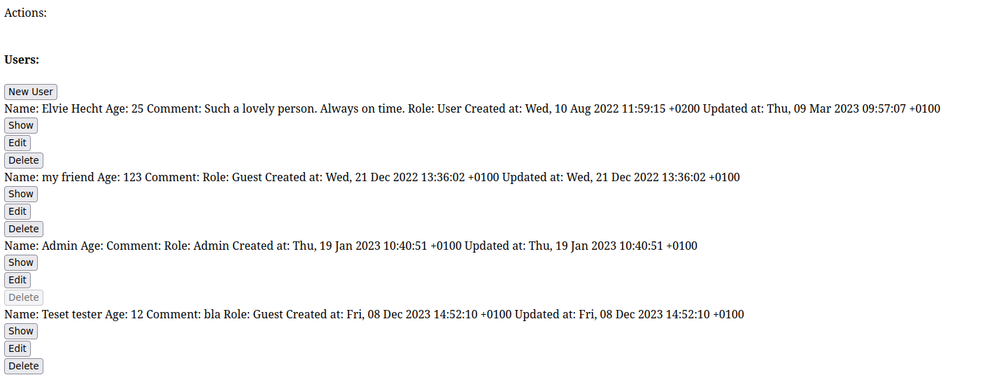

TODO: Write this

Notes:

- `model` is an ApplicationModel or similar (e.g. ActiveType, but not guarantted to work at this point), `.model_name` is important
- `data` can be model or models
- To redirect instead of rendering, use `before_render` if the redirect is conditional (e.g. if validation passes), or `respond` if always redirecting.
  - As a rule of thumb, use `before_render` if there is a `content` block (even by inheritance) and `respond` otherwise.
- To protect a custom controller by compony authentication, use in the controller: `before_action Compony.authentication_before_action`

Feature sets:

- Base feature: Components
  - replace routes, views and controllers
  - actions
  - params and nesting
  - skipping authentication
  - lifecycle
    - standalone
    - resourcefulness
    - authorization
- Buttons and links
  - labelling
  - coloring
- Fields and field groups
- Feasibility
- Premade components
  - button
  - destroy
  - form
  - with_form
  - new
  - edit

# Introduction

Compony is a Gem that allows you to write your Rails application in component-style fashion. It combines a controller action and route along with its view into a single Ruby class. This allows writing much DRYer code, using inheritance even in views and much easier refactoring for your Rails applications, helping you to keep the code clean as the application evolves.

Compony's key aspects:

- A Compony component is a single class that exports route(s), controller action(s) and a view to Rails.
  - Refactor common logic into your own components and inherit from them to DRY up your code.
- Compony's powerful model mixin allows you to define metadata in your models and react to them. Examples:
  - Compony fields capture attributes that should be made visible in your UI. They allow you to implement formatting behavior for various types, e.g. URLs, phone numbers, colors etc.
  - Compony's feasibility framework allows you to prohibit actions based on conditions, along with an error message. This causes all buttons pointing to that action to be disabled with a meaningful error message.
- Compony only structures your code, but provides no style whatsoever. It is like a bookshelf rather than a reader's library. You still implement your own layouts, CSS and Javascript to define the behavior of your front-end.
- Using Compony, you **can** write your application as components, but it is still possible to have regular routes, controllers and views in parallel to it. This way, you can migrate your applications to Compony little by little. It is also possible to render Compony components from regular views and vice versa.
- Compony is built for Rails 7 and fully supports Stimulus and Turbo Drive. Turbo Frames and Streams are not yet targetted, so Compony is currently meant for websites where every click triggers a "full page load" (in quotes because they are not actually full page loads due to Turbo Drive).
- Compony uses CanCanCan (https://github.com/CanCanCommunity/cancancan) for authorization but does not provide an authentication mechanism. You can easily build your own by creating login/logout components that manage cookies, and configure Compony to enforce authentication using the `Compony.authentication_before_action` setter.

## State of the project

I am actively using this framework in various applications and both performance and reliability are good. However, the project is at an early stage and is lacking peer reviews and especially automatic testing, such as unit and integration tests. Also, expect there to be (documented) breaking changes in the future, as the API will likely be further refined, resulting in renamings and deprecation of various methods.

## Example

To get you a rough idea what working with Compony feels like, let's look at a small dummy application using Compony from scratch, to make this example as explicit as possible. In practice, much of the logic shown here would be moved to abstract components that you can inherit from.

The example is meant to be read top-down and information will mostly not be repeated. Comments will give you a rough idea of what's going on on each line. The features are more completely documented in subsequent chapters.

Let's implement a simple user management page with Compony. User's have a name, an integer age, a comment, as well as a role (which we will conveniently model using `AnchorModel`: https://github.com/kalsan/anchormodel). We want to be able to list, show, create, edit and destroy users. Users having the role Admin shall not be destroyed.

### The User model

We'll assume a model that has the standard Rails schema:

```ruby
create_table 'users', force: :cascade do |t|
    t.string 'name'
    t.string 'comment'
    t.integer 'age'
    t.datetime 'created_at', null: false
    t.datetime 'updated_at', null: false
    t.string 'role', default: 'guest', null: false
  end
```

```ruby
class User < ApplicationRecord
  # Refer to https://github.com/kalsan/anchormodel
  belongs_to_anchormodel :role

  # Fields define which attributes are relevant in the GUI and how they should be presented.
  field :name, :string
  field :age, :integer
  field :comment, :string
  field :role, :anchormodel
  field :created_at, :datetime
  field :updated_at, :datetime

  # The method `label` must be implemented on all Compony models. Instead of this method, we could also rename the column :name to :label.
  def label
    name
  end

  # This is how we tell Compony that admins are not to be destroyed.
  prevent :destroy, 'Cannot destroy admins' do
    role == Role.find(:admin)
  end
end
```

### The Show component

This components loads a user by reading the param `id`. It then displays a simple table showing all the fields defined above.

We will implement this component on our own, giving you an insight into many of Compony's mechanisms:

```ruby
# All components (except abstract ones) must be placed in the `Components` namespace living under `app/components`.
# They must be nested in another namespace, called "family" (here, `Users`), followed by the component's name (here, `Show`).
class Components::Users::Show < Compony::Component
  # The Resourceful mixin causes a component to automatically load a model from the `id` parameter and store it under `@data`.
  # The model's class is inferred from the component's name: `Users::Show` -> `User`
  include Compony::ComponentMixins::Resourceful

  # Components are configured in the `setup` method, which prevents loading order isues.
  setup do
    # The DSL call `label` defines what what is the title of the component and which text is displayed on links and buttons pointing to it.
    # It accepts different formats and takes a block. Given that this component always loads one model, the block must take an argument which is the model.
    # The argument must be provided by links and buttons pointing to this component.
    label(:short) { |_u| 'Show' } # The short format is suitable for e.g. a button in a list of users.
    label(:long) { |u| "Show user #{u.label}" } # The long format is suitable e.g. in a link in a text about this user.

    # Actions point to other components. They have a name that is used to identify them (e.g. in the `prevent` call above) and a block returning a button.
    # Compony buttons take the name to an action and either a family name or instance, e.g. a Rails model instance.
    # Whether or not an instance must be passed is defined by the component the button is pointing to (see the comment for `label` earlier in the example).
    action(:index) { Compony.button(:index, :users) } # This points to `Components::Users::Index` without passing a model (because it's an index).
    action(:edit) { Compony.button(:edit, @data) } # This points to `Components::Users::Edit` for the currently loaded model. This also checks feasibility.

    # When a standalone config is present, Compony creates one or multiple Rails routes. Components without standalone config must be nested within others.
    standalone path: 'users/show/:id' do # This specifies the path to this component.
      verb :get do # This speficies that a GET route should be created for the path specified above.
        authorize { true } # Immediately after loading the model, this is called to check for authorization. `true` means that anybody can get access.
      end
    end

    # After loading the model and passing authorization, the `content` block is evaluated. This is compony's equivalent to Rails' views.
    # Inside the `content` block, the templating Gem Dyny (https://github.com/kalsan/dyny) is used, allowing you to write views in plain Ruby.
    content do
      h3 @data.label # Display a <h3> title
      table do # Open a <table> tag
        tr do # Open a <tr> tag
          # Iterate over all the fields defined in the model above and display its translated label (this uses Rails' `human_attribute_name`), e.g. "Name".
          @data.fields.each_value { |field| th field.label }
        end # Closing </tr>
        tr do
          # Iterate over the fields again and call `value_for` which formats each field's value according to the field type.
          @data.fields.each_value { |field| td field.value_for(@data) }
        end
      end
    end
  end
end
```

Here is what our Show component looks like when we a layout with the bare minimum and no styling at all:


It is important to note that actions, buttons, navigation, notifications etc. are handled by the application layout. In this and the subsequent screenshots, we explicitely use minimalism, as it makes the generated HTML clearer.

### The Destroy component

Compony has a built-in abstract `Destroy` component which displays a confirmation message and destroys the record if the verb is `DELETE`. This is a good example for how DRY code can become for "boring" components. Since everything is provided with an overridable default, components without special logic can actually be left blank:

```ruby
class Components::Users::Destroy < Compony::Components::Destroy
end
```

Note that this component is fully functional. All is handled by the class it inherits from:


### The New component and the Form component

Compony also has a pre-built abstract `New` component that handles routing and resource manipulation. It combines the controller actions `new` and `create`, depending on the HTTP verb of the request. Since it's pre-built, any "boring" code can be omitted and our `New` components looks like this:

```ruby
class Components::Users::New < Compony::Components::New
end
```

By default, this component looks for another component called `Form` in the same directory, which can look like this:

```ruby
class Components::Users::Form < Compony::Components::Form
  setup do
    # This mandatory DSL call prepares and opens a form in which you can write your HTML in Dyny.
    # The form is realized using the simple_form Gem (https://github.com/heartcombo/simple_form).
    # Inside this block, more DSL calls are available, such as `field`, which automatically generates
    #    a suitable simple_form input from the field specified in the model.
    form_fields do
      concat field(:name) # `field` checks the model to find out that a string input is needed here. `concat` is the Dyny equivalent to ERB's <%= %>.
      concat field(:age)
      concat field(:comment)
      concat field(:role) # Compony has built-in support for Anchormodel and as the model declares `role` to be of type `anchormodel`, a select is rendered.
    end

    # This DSL call is mandatory as well and automatically generates strong param validation for this form.
    # The generatd underlying implementation is Schemacop V3 (https://github.com/sitrox/schemacop/blob/master/README_V3.md).
    schema_fields :name, :age, :comment, :role
  end
end
```

This is enough to render a fully functional form that creates new users:


### The Edit component

Just like `New`, `Edit` is a pre-built component that handles routing and resource manipulation for editing models, combinding the controller actions `edit` and `update` depending on the HTTP verb. It uses that same `Form` component we wrote above and thus the code is as simple as:

```ruby
class Components::Users::Edit < Compony::Components::Edit
end
```

It then looks like this:


### The Index component

This component should list all users and provide buttons to manage them. We'll build it from scratch and make it resourceful, where `@data` holds the ActiveRecord relation.

```ruby
class Components::Users::Index < Compony::Component
  # Making the component resourceful enables a few features for dealing with @data.
  include Compony::ComponentMixins::Resourceful

  setup do
    label(:all) { 'Users' } # This sets all labels (long and short) to 'Users'. When pointing to this component using buttons, we will not provide a model.
    standalone path: 'users' do # The path is simply /users, without a param. This conflicts with `Resourceful`, which we will fix in `load_data`.
      verb :get do
        authorize { true }
      end
    end

    # This DSL call is specific to resourceful components and overrides how a model is loaded.
    # The block is called before authorization and must assign a model or collection to `@data`.
    load_data { @data = User.all }

    content do
      h4 'Users:' # Provide a title
      # Provide a button that creates a new user. Note that we must write `:users` (plural) because the component's family is `Users`.
      concat compony_button(:new, :users) # The `Users::New` component does not take a model, thus we just pass the symbol `:users`, not a model.

      div class: 'users' do # Opening tag <div class="users">
        @data.each do |user| # Iterate the collection
          div class: 'user' do # For each element, open another div
            User.fields.values.each do |field| # For each user, iterate all fields
              span do # Open a <span> tag
                concat "#{field.label}: #{field.value_for(user)} " # Display the field's label and apply it to value, as we did in the Show component.
              end
            end
            # For each user, add three buttons show, edit, destroy. The method `with_button_defaults` applies its arguments to every `compony_button` call.
            # The option `format: :short` causes the button to call the target component's `label(:short) {...}` label function.
            Compony.with_button_defaults(label_opts: { format: :short }) do
              concat compony_button(:show, user) # Now equivalent to: `compony_button(:show, user, label_opts: { format: :short })`
              concat compony_button(:edit, user)
              concat compony_button(:destroy, user)
            end
          end
        end
      end
    end
  end
end
```

The result looks like this:



# TODO

# Caveats

- The API is not yet as consistent as I'd like it. Examples:
  - `content` replaces the content and `add_content` inserts some, but for actions the insertion is called `action`.
  - Every DSL call, in particular nested ones, should be able to insert and/or override a precise call in the parent class. Override behavior should be made consistent across the entire Compony DSL. For instance, it makes no sense that `add_content` uses an index while `action` uses `before` with a keyword.
- At this point, I haven't gotten into Turbo Streams and Turbo Frames. It would be interesting to exend Compony such it also makes writing applications using these features much easier.
- The feasibility framework does not yet enforce prevention, but only has effects on buttons. Actions should be structured more explicitely such that prevention becomes as tight as authorization.